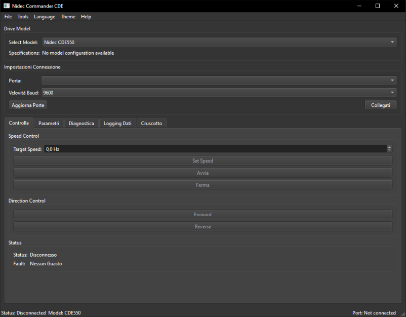

# Nidec CommanderCDE

[](https://github.com/Nsfr750/Nidec_CommanderCDE/releases/latest)
[](https://www.python.org/)
[](https://www.gnu.org/licenses/gpl-3.0)
[](https://github.com/Nsfr750/Nidec_CommanderCDE/graphs/commit-activity)
[](https://github.com/psf/black)
[](https://github.com/Nsfr750/Nidec_CommanderCDE/actions)
[](https://codecov.io/gh/Nsfr750/Nidec_CommanderCDE)



A comprehensive Python GUI application for controlling and monitoring Nidec Commander CDE drives via Modbus RTU.

## ✨ Features

- **Multi-language Support**: Complete interface in English and Italian with dynamic language switching

- **Multi-Model Support**: Compatible with CDE400, CDE550, CDE750, and CDE1100S drive models

- **Drive Control**:

  - Connect to Nidec Commander CDE drives via RS-485/Modbus RTU
  - Control motor speed and direction
  - Start/Stop the drive
  - Real-time monitoring of drive status and diagnostics
  - Fault detection and reset functionality
  - Parameter backup and restore

- **User Interface**:

  - Modern, tabbed interface with intuitive controls
  - Comprehensive dashboard with real-time metrics
  - Status bar with connection and drive status
  - Responsive design with Dark/Light theme support
  - Customizable interface elements

- **Data Management**:

  - Real-time monitoring and logging of drive parameters
  - Data export to CSV/Excel
  - Graph visualization for parameter trends
  - Configurable data logging intervals

- **Diagnostics**:

  - Comprehensive parameter monitoring
  - Fault history and logging
  - System status indicators
  - Real-time performance metrics

## 🆕 What's New in v0.0.5

### New Features

- Added support for multiple Nidec drive models (CDE400, CDE550, CDE750, CDE1100S)
- Complete Italian translations for all UI elements
- Enhanced help system with detailed documentation
- Blue theme for better readability in help sections

### Improvements

- Updated UI for better user experience
- Improved error messages and logging
- Optimized performance for real-time monitoring
- Resolved PyQt6 compatibility issues
- Fixed language switching in help dialogs

## 🚀 Requirements

- Python 3.8 or higher
- PyQt6 >= 6.6.1
- pyserial >= 3.5
- pymodbus >= 3.5.4
- PyQt6-QScintilla >= 2.14.1
- python-dotenv >= 1.0.0

## 🛠 Installation & Setup

1. Clone the repository:

   ```bash
   git clone https://github.com/Nsfr750/nidec-commandercde.git
   cd nidec-commandercde
   ```

2. Create and activate a virtual environment (recommended):

   ```bash
   python -m venv venv
   # On Windows:
   .\venv\Scripts\activate
   # On Unix or MacOS:
   # source venv/bin/activate
   ```

3. Install the required packages:

   ```bash
   pip install -r requirements.txt
   ```

## 🚀 Basic Usage

1. Connect your Nidec Commander CDE drive to your computer via RS-485 adapter
2. Launch the application:

   ```bash
   python main.py
   ```

3. Select the appropriate COM port and baud rate
4. Click 'Connect' to establish communication with the drive
5. Use the interface to control and monitor the drive

## Connection Settings

- Baud Rate: 9600
- Data Bits: 8
- Parity: Even
- Stop Bits: 1
- Modbus Address: 1 (default, can be changed in drive parameters)

## Important Notes

- This software is provided as-is without any warranty
- Always ensure proper electrical connections and safety measures when working with motor drives
- The default register addresses are based on typical Nidec drive configurations but may need adjustment for your specific model
- Refer to the Nidec CDE 400 Commander manual for detailed information about parameters and register addresses

## 📝 License

This project is licensed under the GPL3 License - see the [LICENSE](LICENSE) file for details.

## 🤝 Contributing

Contributions are welcome! Please read our [Contributing Guidelines](CONTRIBUTING.md) for details on our code of conduct and the process for submitting pull requests.
